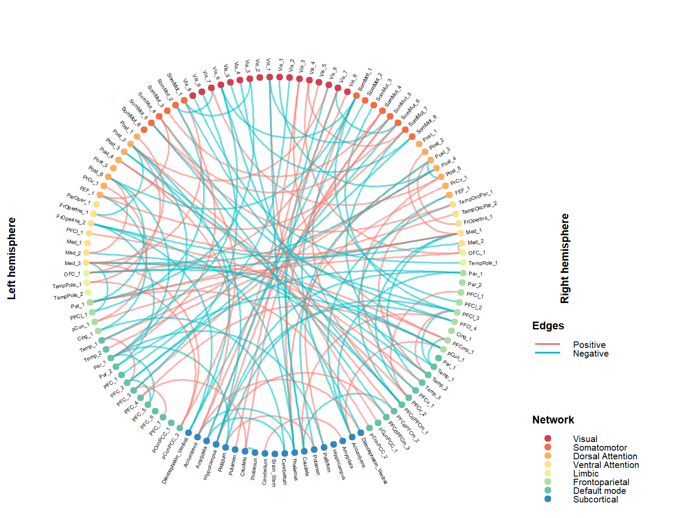

# FCtools: Visualizing brain connectivity

Cognitive and Brain Health Laboratory 2024-07-09

### **1. Introduction**

The FCtools package contains a collection of in-house R functions for
post-processing, analyzing and visualizing brain connectivity data (see
[here](https://cogbrainhealthlab.github.io/FCtools/reference/index.html)
for the full list of functions). This readme will show you how to
generate connectograms and chord diagrams to illustrate your brain
connectivity-related results, both SC and FC. Currently, in our
neuroimaging database, we have connectivity data that are derived from
different atlas parcellation schemes, as a result, the lengths of the
input vectors (N x N FC/SC matrix stringed out into a single vector) are
contingent upon the atlas parcellation schemes used.

### **2. Connectogram**

**a. Install packages**

If you have not previously installed this package:

``` r
install.packages("devtool")
devtools::install_github("CogBrainHealthLab/FCtools")
```

``` r
library(FCtools)
```

**A. Plotting the connectogram**

The `vizConnectogram()` function can take input vectors of the following
lengths:

-   30135 — derived from 246x246 FC matrices generated using the
    [Brainnetome](https://atlas.brainnetome.org/bnatlas.html) atlas

-   23871 — derived from 219x219 FC matrices generated using the
    [Schaefer](https://github.com/ThomasYeoLab/CBIG/tree/master/stable_projects/brain_parcellation/Schaefer2018_LocalGlobal)-200
    atlas + 19 subcortical regions from the freesurfer subcortical
    segmentations. This is typically used in the NIMH datasets

-   7021 — derived from 119x119 FC matrices generated using the
    [Schaefer](https://github.com/ThomasYeoLab/CBIG/tree/master/stable_projects/brain_parcellation/Schaefer2018_LocalGlobal)-100
    atlas + 19 subcortical regions from the freesurfer subcortical
    segmentations. This is typically used in the ABCD dataset

-   4005 — derived from 90x90 SC matrices generated using the
    [AAL](https://www.sciencedirect.com/science/article/abs/pii/S1053811901909784?via%3Dihub)-90
    atlas

The number of nodes to display in the connectogram plot will be
automatically determined from the length of the input vector.

For the first example, we will generate a sparse vector of 23871 random
numbers ranging from -1 to 1 and use this vector as the input vector to
simulate the results derived from running the network-based statistics
on the 219x219 FC matrices. The vector is ‘sparse’ because it contains
very few non-zero values. You will see why this is important later

``` r
results=sample(c(1,0, -1), 23871, replace = TRUE, prob = c(0.001, 0.998,0.001))
```

In the above line, the frequency of the numbers `c(1,0, -1)` appearing
in the vector corresponds to the specified probabilities
`prob = c(0.001, 0.998,0.001)`. Next, we will call upon the
`vizConnectogram()` function from the cloud, and run it on the `results`
vector

``` r
vizConnectogram(data=results, filename="FC_219.png")
```

The above code will output the following `FC_219.png` image in your
working directory. Do note that the distribution of nodes in the
Schaefer-100 and Schaefer-200 parcellation schemes is not symmetrical
across both hemispheres.


**B. Customizing optional parameters**

The `vizConnectogram()` allows you to customize the following visual
parameters

-   `hot` : color code or name for the color of positive edges

-   `cold` : color code or name for the color of positive edges

-   `edgethickness`: thickness of the edge links; default thickness is
    set to `0.8`

-   `colorscheme`: a vector of 8 color codes/names for all FC matrices
    or 7 color codes/names for SC matrices

In the next example, we will simulate results derived from the
brainnetome atlas (246x246 FC matrices; length of input vector=30135)
and also play around with the color-related parameters,

``` r
results=sample(c(1,0, -1), 30135, replace = TRUE, prob = c(0.001, 0.998,0.001))

## to generate color codes for the color scheme
library(paletteer) 
colorcodes=c(paletteer_c("ggthemes::Sunset-Sunrise Diverging", 8))

vizConnectogram(data=results, filename="FC_246.png", hot="red", cold="blue", colorscheme=colorcodes)
```

The above code will output the following `FC_246.png` image in your
working directory.  As you can see it can be a little
difficult to differentiate which network the nodes belong to because the
colors are too similar. So do pay attention to the choice of colors if
you were to adjust the `colorscheme` parameter

**C. Excessive cluttering**

The connectograms are ideal for visualizing sparse FC/SC matrices. If
there are too many non-zero values in these matrices, the connectogram
can become too cluttered and consequently difficult to interpret. Here’s
an example:

``` r
results=sample(c(1,0, -1), 7021, replace = TRUE, prob = c(0.01, 0.98,0.01))
vizConnectogram(data=results, filename="FC_119.png")
```


You can make it look a little less cluttered by reducing the thickness
of the edge links. Note that the default value is `0.8`

``` r
vizConnectogram(data=results, filename="4xFC_119_thinedges.png",edgethickness = 0.5)
```

 This will be very effective if the
edges are nicely bundled up, which isn’t the case for the above. So if
you tried to reduce the thickness of the edge links and it doesn’t help
much, then perhaps you should use a chord diagram instead

**C. Multiple connectograms**

If necessary, you can plot out multiple connectograms and fit them nicely in a grid format.

``` r
network1=sample(c(1,0, -1), 7021, replace = TRUE, prob = c(0.005,0.99,0.005)) 
network2=sample(c(1,0, -1), 7021, replace = TRUE, prob =c(0.005, 0.99,0.005)) 
network3=sample(c(1,0, -1), 7021, replace = TRUE, prob = c(0.005, 0.99,0.005)) 
network4=sample(c(1,0, -1), 7021, replace = TRUE, prob = c(0.005, 0.99,0.005))

vizConnectogram(data=rbind(network1,network2,network3,network4),
                           filename="4xFC_119.png",
                           ncol=2,
                           nrow=2,
                           title=c("a)Network 1","b)Network 2","c)Network 3","d)Network 4"))
```
 

### **3. Chord diagram**

The `vizChord()` function can take input vectors of various lengths as
described in the connectogram section and additionally, vectors of 68
values — derived from 12x12 functional network matrices generated using
the
[Gordon](https://academic.oup.com/cercor/article/26/1/288/2367115?login=falseb)
atlas. The 12x12 functional network matrices are only available in the
ABCD dataset.

**A. Plotting the chord diagram**

Here’s a basic use of the `vizChord()` function on an input vector of
7021 <u>non-zero values</u> ranging from -1 to 1.

``` r
results=runif(7021, min = -1, max = 1)

vizChord(data=results, filename="FC_chord119.png")
```


Just like the `vizConnectogram()` function, you can customize the `hot`
and `cold` colors, as well as the colors for the networks. Note that if
your input vector has a length of 78 (derived from the 12x12 functional
network matrices), you will need to specify 12 colors (because 12
networks) for the `colorscheme`.

**B. Customizing optional parameters**

``` r
results=runif(78, min = -1, max = 1)

## to generate color codes for the color scheme
library(paletteer) 
colorcodes=c(paletteer_c("grDevices::Temps", 12))

vizChord(data=results, filename="FC_chord12.png", hot="red", cold="blue", colorscheme = colorcodes)
```


**C. Multiple connectograms**

Just as above, you can plot out multiple chord diagrams and fit them nicely in a grid format.

``` r
network1=sample(c(1,0, -1), 7021, replace = TRUE, prob = c(0.005,0.99,0.005)) 
network2=sample(c(1,0, -1), 7021, replace = TRUE, prob =c(0.005, 0.99,0.005)) 
network3=sample(c(1,0, -1), 7021, replace = TRUE, prob = c(0.005, 0.99,0.005)) 
network4=sample(c(1,0, -1), 7021, replace = TRUE, prob = c(0.005, 0.99,0.005))

vizChord(data=rbind(network1,network2,network3,network4),
                           filename="4xFCchord_119.png",
                           ncol=2,
                           nrow=2,
                           title=c("a) Network 1","b) Network 2","c) Network 3","d) Network 4"))
```
 


